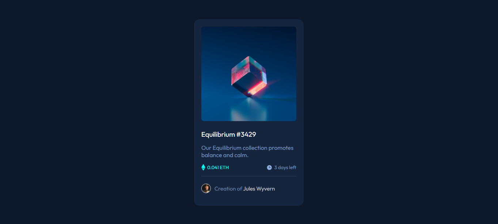

# Frontend Mentor - NFT preview card component solution

This is a solution to the [NFT preview card component challenge on Frontend Mentor](https://www.frontendmentor.io/challenges/nft-preview-card-component-SbdUL_w0U). Frontend Mentor challenges help you improve your coding skills by building realistic projects.

## Overview

### The challenge

Users should be able to:

- View the optimal layout depending on their device's screen size
- See hover states for interactive elements

### Screenshot

### Links

- Solution URL: [My solution](https://www.frontendmentor.io/solutions/your-solution-url)
- Live Site URL: [View live site](https://www.your-live-site-url.com)

## My process

### Built with

- Semantic HTML5 markup
- CSS custom properties
- Flexbox

### What I learned

During this project, I learned how to implement responsive designs using a mobile-first approach. I also improved my skills in creating interactive elements with smooth hover transitions.

### Continued development

In future projects, I plan to further enhance my skills in using CSS Grid and exploring more advanced JavaScript techniques for dynamic content.

### Useful resources

- [MDN Web Docs](https://developer.mozilla.org/): A valuable resource for HTML, CSS, and JavaScript documentation.
- [CSS-Tricks](https://css-tricks.com/): An excellent blog with tutorials and articles about various web development topics.

## Author

- Frontend Mentor - [@sliyarli](https://www.frontendmentor.io/profile/sliyarli)
